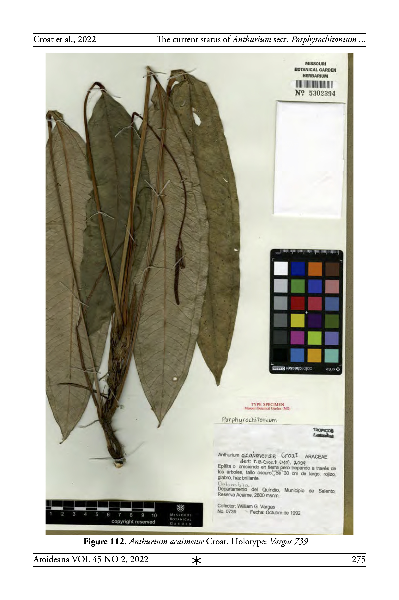

# Anthurium acaimense

**Genus**: *Anthurium*
**Section**: *Porphyrochitonium*
**Authorship**: Croat & W.Vargas

## Distribution
- **Altitudinal Range**: 2000  -  2800 m
- **Biogeographical Region**: Andes
- **Detailed Distribution**: Anthurium acaimense is endemic to Colombia, known only from the type locality along the upper Río Quindío in Quindío Department between 2000– 2800 m elevation in a Montane wet forest life zone.

## Habitat
Montane wet forest life zone.

## Botanical Description
Terrestrial to hemiepiphytic and climbing; internodes to 2.7 cm long (much shorter near apex) 6 mm diam. (dried), drying finely ribbed and blackened; cataphylls persisting with fibers in dark brown reticulum, 5.5–7.0 cm long, narrowly attenuated at apex. Leaves 56.8 cm long, clustered near apex; petioles subterete, sulcate, 31 cm long, 0.3−0.4 cm diam., drying medium brown, weakly glossy, finely ribbed; geniculum 0.6 cm long, drying darker than petiole and laterally winged; blades elliptic, 21.5−29.0 cm long, 5.5−7.8 cm wide, 3.7–4.0 times longer than broad (averaging 4.0), acuminate, acute at base, subcoriaceous, moderately dark green, tinged with red and semiglossy above, moderately paler and semiglossy below, drying weakly glossy and grayish olive-green to medium brown above, paler and grayish yellow-brown to grayish yellow-green below; midrib drying narrowly raised to acute in valley above, narrowly raised, finely ribbed, yellow-brown below; primary lateral veins 17–20 per side, departing mid- rib at 45–55°, drying narrowly raised in shallow valleys above, acutely raised on lower surface; collective veins arising from the basal vein, more prominent than primary lateral veins, 5–7 mm from margin, drying etched above, narrowly raised to bluntly acute below; tertiary veins prominulous below, slightly less so above upon drying; upper surface eglandular, drying matte, with a few scattered pale pustules; lower surface smoother, finely dark glandular-punctate. Inflorescence 44.2 cm long, erect; peduncle 39 cm long, 11.1 times longer than spathe, drying dark brown; spathe lanceolate, green, dark brown, 3.5 cm long; spadix cylindroid-tapered, 5.2 cm long, 0.2–0.3 cm diam.; flowers 5–6 visible per spiral, 1.2 mm long, 1.2 mm wide; lateral tepals oval, 3-sided, 0.4 mm wide, 0.8 mm long. Infructescence with berries maturing orange.

## Miscellaneous
Etymology — The species is named for the type locality in the Reserva Acaime in Quindío Department, Municipio de Salento. Comments — In the Lucid Anthurium Key, Anthurium acaimense tracks to A. aureum Engl. which may be distinguished by its shorter petiole (20 cm), broader blade (length-width ratio 3) and long apiculum (2 cm); A. smithii Croat which has a long geniculum (2.4 cm), only 4–9 per side of primary lateral veins and the blades have obtuse to rounded bases and A. trianae Engl. which has shorter petioles (20 cm), only 8 or 9 primary lateral veins per side and the blades oblong rather than elliptic.

## Diagnostic Features
Diagnosis: Anthurium acaimense is a member of sect. Porphyrochitonium and is charactezed by its oblong-elliptic, glandular-punctate blades with a single pair of collective veins. It is unusual in having rather elongated internodes for a species in this section. It is further characterized by semi-intact cataphylls, moderately long-petiolate leaves with subterete, sulcate petioles and a long-pedunculate inflorescence with a slender, weakly tapered spadix.

## References
- **Published in**: Aroideana 45(2): 274 (2022)
